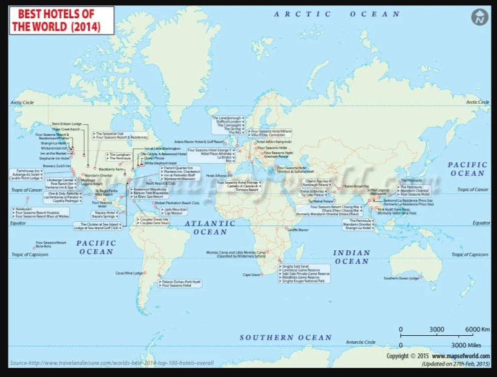

# Python API Challenge

## Observation

Here are the rephrased versions of your findings:

### Temperature Analysis:
* The analysis revealed that cities located closer to the equator (Latitude 0) tend to have higher temperatures. As one moves farther north from the equator, the temperature significantly decreases. In contrast, moving south from the equator also results in a temperature drop, but this decrease is less pronounced compared to the northern hemisphere. Regression analysis and plotting demonstrate a strong negative correlation between temperature and latitude in the northern hemisphere. However, in the southern hemisphere, the correlation between temperature and latitude is weakly negative.

### Humidity and Cloudiness:
* The analysis of data, plots, and regression lines did not show any significant relationship between humidity and cloudiness with proximity to the equator (latitude 0). The correlation between humidity and latitude in both hemispheres is weak and negative, as is the correlation between cloudiness and latitude. Thus, humidity appears to be fairly consistent across cities in both hemispheres, regardless of their distance from the equator.

### Wind Speed Analysis:
* The analysis of wind speed (mph) in relation to latitude showed that cities closer to the equator (latitude 0) experience lower wind speeds, while wind speed tends to increase for cities further from the equator. Regression analysis indicates a weak positive correlation between wind speed and latitude in northern hemisphere cities.

### Interactive Geospatial Analysis:
* In the second task, VacationPy, I recognize that utilizing exploratory interactive geospatial tools, weather information, heat maps, and visualization through Google API and similar applications is crucial for unlocking the socio-economic value hidden within large datasets.

Based on the results from part one, we aimed to create interactive geospatial visualizations using API keys.
A fun discovery was finding a hotel from my home country!